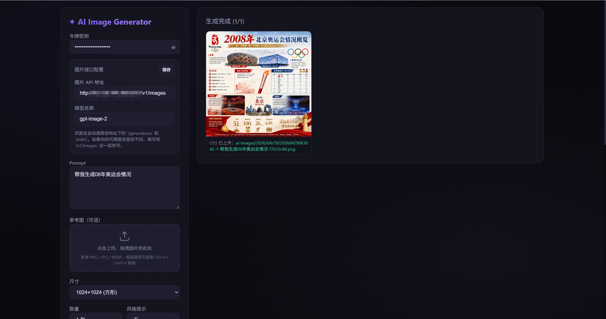
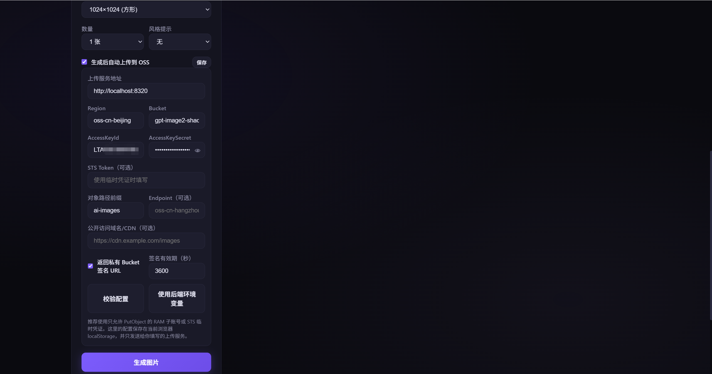
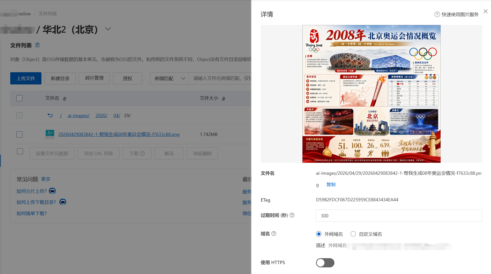

# image2-oss

一个简易的通过调用GPT的gpt-image-2模型在本地生成图片页面，支持在生成完成后自动上传到用户自己的阿里云 OSS。

## 架构

- `gpt-image.html`：浏览器页面，负责填写图片接口地址、模型名称、OpenAI API Key、生成参数、参考图、OSS 配置，并在生成成功后调用上传服务。
- `server.js`：本地上传服务，负责接收前端传来的图片 Data URL，使用阿里云 OSS SDK 执行上传。
- `src/oss-utils.js`：OSS 配置校验、对象名生成、Data URL 解析等纯函数。
- `tests/oss-utils.test.js`：基础单元测试。

生成链路：

1. 页面按“图片接口配置”里填写的地址调用 `/generations` 或 `/edits` 生成图片。
2. 页面拿到 `b64_json` 后转成 Data URL。
3. 如果启用“生成后自动上传到 OSS”，页面调用 `http://localhost:8320/api/oss/upload`。
4. 上传服务把图片写入阿里云 OSS，并返回对象名和访问 URL。

## 安装和启动

```powershell
npm install
npm start
```

上传服务默认监听：

```text
http://localhost:8320
```

然后访问页面：

```text
http://127.0.0.1:8320/gpt-image.html
```

## Java 版本

仓库现在额外提供了一个独立的 Java 上传服务子工程，路径在 `java/`，默认端口是 `8321`，这样可以和现有 Node 版同时运行。

启动方式：

```powershell
cd java
mvn spring-boot:run
```

启动后可以访问：

```text
http://127.0.0.1:8321/health
http://127.0.0.1:8321/gpt-image.html
```

如果你想让现有页面改走 Java 上传服务，只需要把页面里的 OSS 上传地址切到：

```text
http://127.0.0.1:8321/api/oss/upload
```

Java 版接口语义与 Node 版保持一致：

- `GET /health`
- `POST /api/oss/validate`
- `POST /api/oss/upload`

页面里的“图片接口配置”可以填写：

- 图片 API 地址：默认 `http://127.0.0.1:8317/v1/images`
- 模型名称：默认 `gpt-image-2`

这些配置会保存在当前浏览器的 localStorage。

## 功能展示


### 图片生成页面



### 生成后自动上传 OSS



### 阿里云 OSS 文件列表




## OSS 配置方式

可以在页面里填写 OSS 配置并保存到当前浏览器，也可以通过后端环境变量配置。

推荐使用 RAM 子账号或 STS 临时凭证，并只授予目标路径下的 `oss:PutObject` 权限。

支持的环境变量：

```powershell
$env:OSS_REGION="oss-cn-hangzhou"
$env:OSS_BUCKET="your-bucket"
$env:OSS_ACCESS_KEY_ID="your-access-key-id"
$env:OSS_ACCESS_KEY_SECRET="your-access-key-secret"
$env:OSS_STS_TOKEN=""
$env:OSS_PATH_PREFIX="ai-images"
$env:OSS_ENDPOINT=""
$env:OSS_PUBLIC_BASE_URL=""
$env:OSS_USE_SIGNED_URL="false"
$env:OSS_SIGNED_URL_EXPIRES="3600"
npm start
```

如果 Bucket 是私有的，可以在页面勾选“返回私有 Bucket 签名 URL”，或设置：

```powershell
$env:OSS_USE_SIGNED_URL="true"
```

## 接口

### `GET /health`

健康检查。

### `POST /api/oss/validate`

只做配置格式校验，不会向 OSS 写入或删除对象。

### `POST /api/oss/upload`

请求体：

```json
{
  "oss": {
    "provider": "aliyun",
    "region": "oss-cn-hangzhou",
    "bucket": "your-bucket",
    "accessKeyId": "your-access-key-id",
    "accessKeySecret": "your-access-key-secret",
    "pathPrefix": "ai-images"
  },
  "prompt": "a cyberpunk city",
  "index": 0,
  "image": "data:image/png;base64,..."
}
```

响应：

```json
{
  "ok": true,
  "provider": "aliyun",
  "bucket": "your-bucket",
  "objectName": "ai-images/2026/04/29/...",
  "contentType": "image/png",
  "size": 12345,
  "url": "https://..."
}
```

## 测试

Java 子工程测试：

```powershell
cd java
mvn test
```
